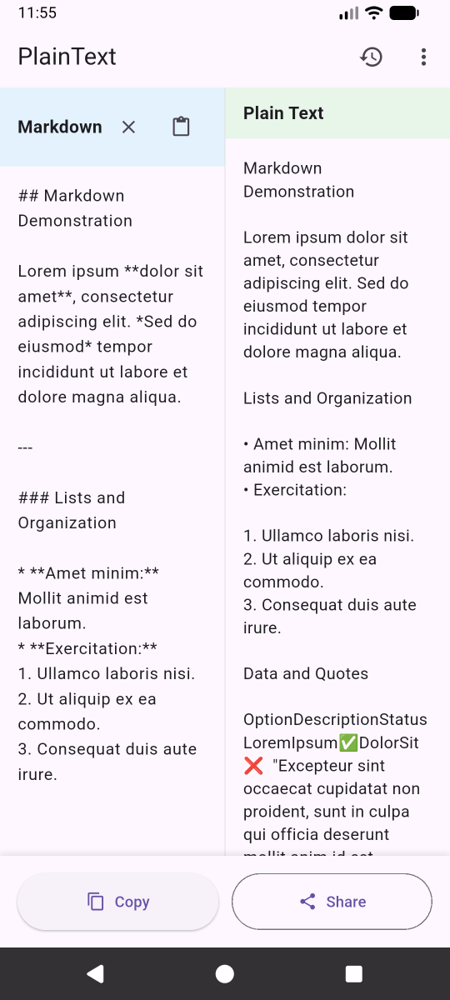
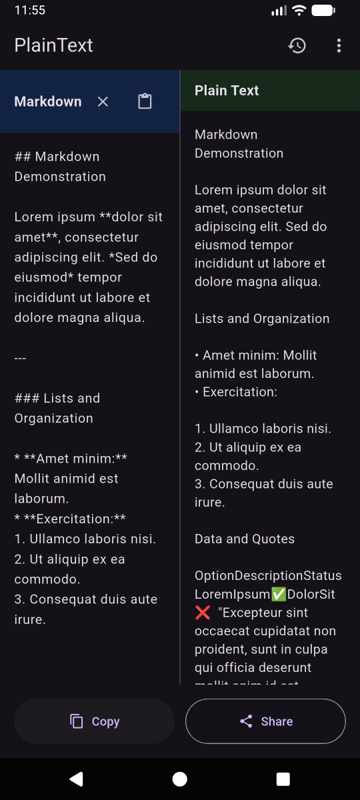
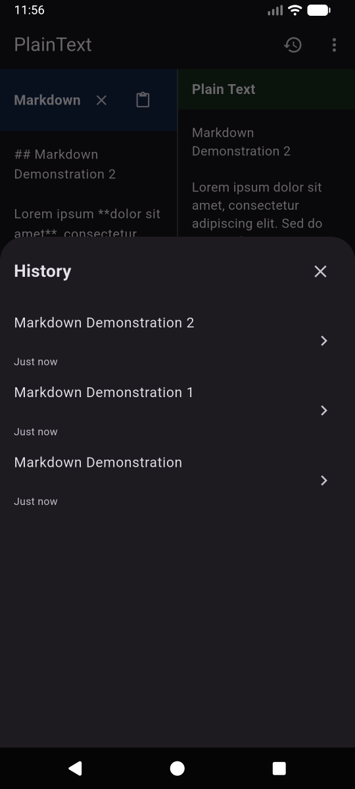

# PlainText - Clean Text from Markdown Formatting

<div align="center">


**Convert markdown-formatted text from AI chatbots into clean, readable plain text**

[](https://play.google.com/apps/testing/com.aital.plaintext)
[](https://flutter.dev)
[](LICENSE)

[Download on Google Play](https://play.google.com/apps/testing/com.aital.plaintext) • [Report Bug](issues) • [Request Feature](issues)

</div>

---

## 📱 About

**PlainText** is a free, ad-free Android app that instantly removes markdown formatting from text copied from AI chatbots like ChatGPT, Claude, Gemini, and others. Perfect for sharing AI-generated content in messengers, SMS, and social media where markdown formatting looks messy or broken.

### The Problem

When you copy responses from AI assistants, the text often contains markdown formatting:
```
**Bold text**, *italic*, # Headers, • Lists, `code`, [links](url)
```

This looks messy in WhatsApp, Telegram, SMS, and other messaging apps.

### The Solution

PlainText instantly converts it to clean, readable plain text:
```
Bold text, italic, Headers, • Lists, code, links
```

---

## ✨ Features

- 🚀 **Instant Conversion** - Real-time markdown to plain text conversion
- 📋 **One-Tap Copy** - Copy cleaned text to clipboard instantly
- 📤 **Quick Share** - Share directly to any messaging app
- 📝 **Conversion History** - Access your last 20 conversions anytime
- 🎨 **Dark Theme** - Light, Dark, and Auto (system) theme support
- 🔒 **100% Offline** - All conversion happens on your device
- 🚫 **No Ads** - Completely free with no advertisements
- 🔐 **Privacy First** - Your text never leaves your device
- ⚡ **Lightweight** - Small app size, fast performance

---

## 🎯 Use Cases

- ✅ Cleaning ChatGPT, Claude, Gemini, and DeepSeek responses
- ✅ Sharing AI-generated content in WhatsApp, Telegram, SMS
- ✅ Preparing text for social media posts
- ✅ Converting formatted documentation to plain text
- ✅ Removing unwanted markdown symbols from any text

---

## 📸 Screenshots

<div align="center">

| Light Theme | Dark Theme | History |
|------------|-----------|---------|
|  |  |  |

</div>

---

## 🛠️ Tech Stack

- **Framework:** [Flutter](https://flutter.dev) 3.0+
- **Language:** Dart
- **Platforms:** Android 5.0+ (iOS support planned)
- **Key Dependencies:**
  - `markdown` - Markdown parsing
  - `shared_preferences` - Local storage
  - `share_plus` - Share functionality
  - `url_launcher` - External links

---

## 🚀 Getting Started

### Prerequisites

- Flutter SDK 3.0 or higher
- Android Studio / VS Code
- Android device or emulator (Android 5.0+)

## 📦 Supported Markdown Elements

- ✅ Headers (H1-H6)
- ✅ Bold and italic text
- ✅ Bullet lists (unordered)
- ✅ Numbered lists (ordered)
- ✅ Code blocks and inline code
- ✅ Blockquotes
- ✅ Links
- ✅ Images (alt text extraction)
- ✅ Horizontal rules
- ✅ Special characters (em dash, en dash)

---

## 🐛 Known Issues

- None currently reported

Found a bug? [Report it here](issues)

---

## 📄 License

This project is licensed under the MIT License - see the [LICENSE](LICENSE) file for details.

---

## 👨‍💻 Author

**Aital**

- GitHub: [@yourusername](https://github.com/kitecat)
- Google Play: [PlainText App](https://play.google.com/apps/testing/com.aital.plaintext)

---

## 💖 Support

If you find PlainText useful, consider supporting its development:

- ⭐ Star this repository
- 📝 Rate the app on [Google Play](https://play.google.com/apps/testing/com.aital.plaintext)
- ☕ [Support on Patreon](https://patreon.com/your_page)
- 🐛 Report bugs and suggest features

---

## 🙏 Acknowledgments

- ChatGPT and Claude for not only inspiring this app but also helping build it
- Flutter team for the amazing framework
- Markdown package contributors
- All users who provided feedback

---

<div align="center">

[Download Now](https://play.google.com/apps/testing/com.aital.plaintext) • [Report Issue](issues) • [Request Feature](issues)

</div>
